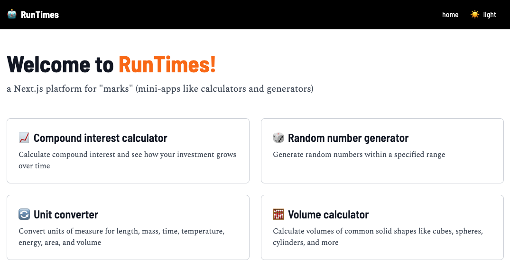
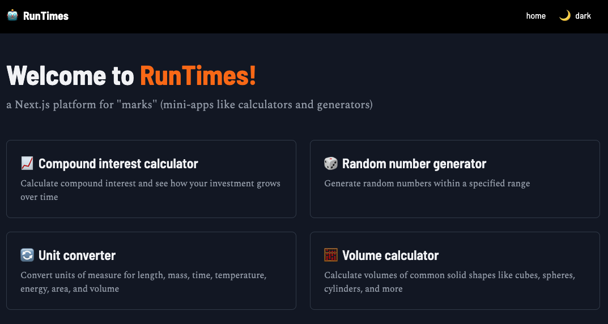
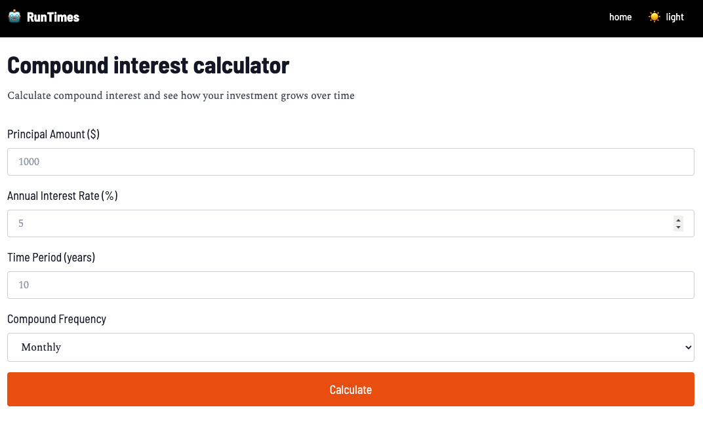

# RunTimes

mixing some software into meaningful bundles



a Next.js starter for marks ("mini-apps") like "calculators" and "generators"

## Forewords

This work is not about the **marks** (i.e. the "mini-apps") themselves, but how it _holds the marks together_ (the old "list and item" framework!)

I made this to help others learn about the inner workings of Next.js and for any "websmith" who wants a quick "non-CMS" web holder thing!

## Hallmarks

This web work has:

* a fixed header 
* a light / dark / system layout




* a home page with a "show more" button to, well, show more "marks"
* clean folder layout for marks: `/mark`
  * each "mark" has its own folder with:
      * `page.tsx` 
      * `metadata.ts` 

* 4 "marks" built-in as a "starter kit", e.g.:



This web work makes note of:

* front-end frameworks: 
  * `next.js` 
  * `tailwind`
* no back-end: 
  * only front-end!

## Runtimes

Run the build on either:

<a href="https://runtimes.joncoded.com" target="_blank"><button>runtimes.joncoded.com</button></a>

or

<a href="https://runtimes-joncoded.vercel.app" target="_blank"><button>runtimes-joncoded.vercel.app</button></a>


## Setup 

### clone repo

Run the following on "Terminal":

```bash
% git clone https://github.com/joncoded/runtimes.git runtimes && cd runtimes
% npm install
```

### run it!

```
% npm run dev
```

It will load by itself onto `http://localhost:3000` on your browser....

(if you already have something on port 3000, it will host the app on `:3001` or on the next free port)

## Thanksgiving

* [Claude (Sonnet)](https://claude.ai) for helping me build this in a much shorter time than we could ever before

